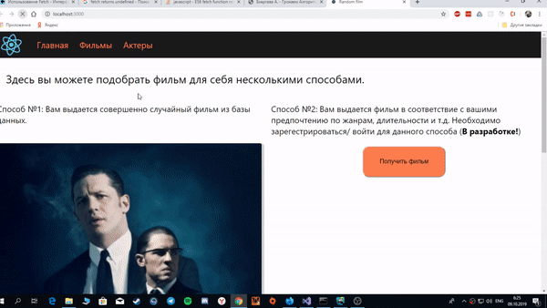

# Random Film
Этот проект делается для того, чтобы изучать REST API и **React.JS**(как самый популярный фронтенд фрэймворк) на практике. На бэкенде используется **ASP.NET Core**. 
Смысл данного приложения в том, чтобы пользователю выдавать рандомный фильм по запросу, а постоянному пользователю в соответствии с его предпочтениями.

____
## Что уже есть
  - Функционирующие прототипы приложений фронтэнда и бэкенда
  - БД(пока с одной таблицей "Фильмы")
  - Запрос к бэкенду и ответ
  - Какая-то разметка
  - "Роутинг" по страницам
  
## Основные планы
  - Приведение страниц в порядок с точки зрения разметки, дизайна и анимации (попутное изучение всего вышеперечисленного)
  - Аутентификация и авторизация пользователей, роли (админ, пользователь и др.)
  - Система рейтинга фильмов (лайки)
  - Подбор фильма в соответствие с предпочтениями пользователя
  - Нормализация бд фильмов (добавление таблицы актеров, жанров и т.д.)
  - **Общий рефакторинг кода**
  
## Что возможно будет реализовано
  - Предложение фильмов пользователями в некую очередь (т.к. бд фильмов заполняется вручную)
  - Отдельное приложение WPF для прямого и быстрого администрирования БД
____
Демо главной страницы и работы запроса. После нормальной разметки будет другое видео и скриншоты.

